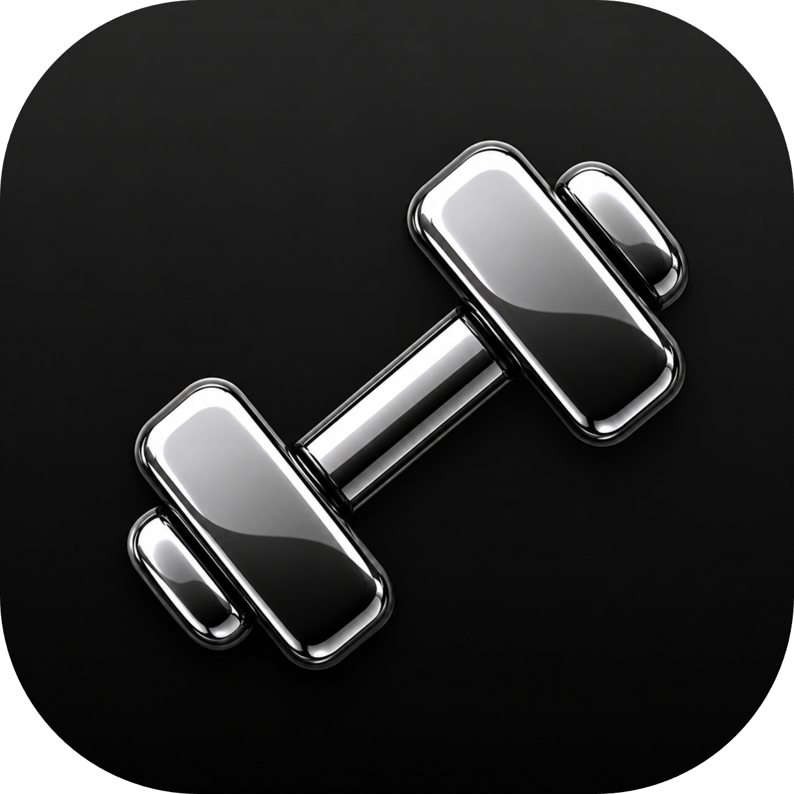
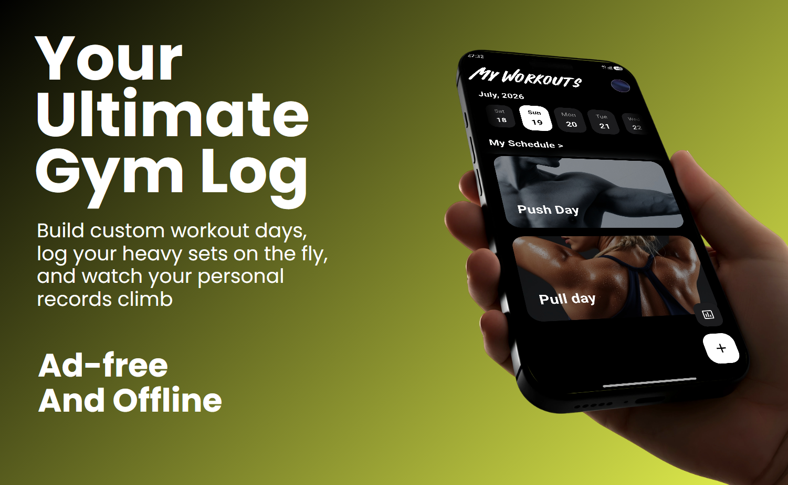
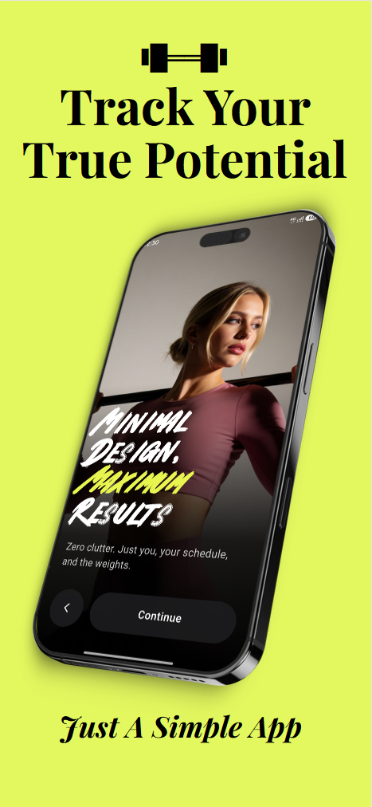
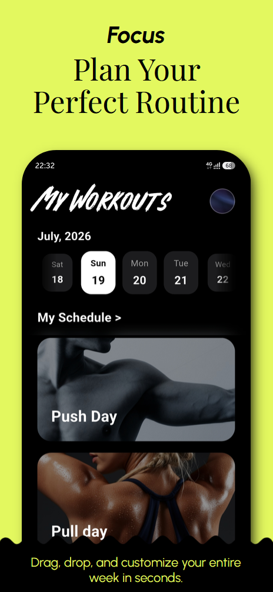
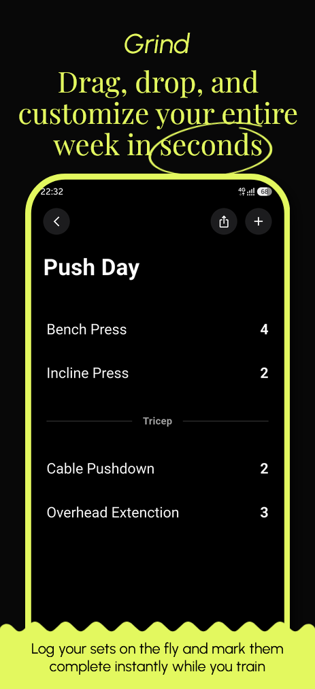
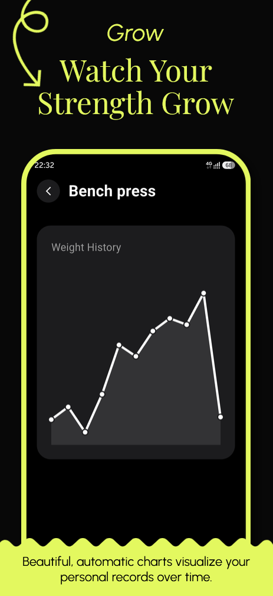

<p align="center">
  <br/>
  
</p>

<h1 align="center">My Workouts</h1>

<p align="center">
  <strong>Your Ultimate Gym Log — Minimal, Ad-Free, and 100% Offline.</strong>
</p>

<p align="center">
  
  
  
  <br/>
  <br/>
  <a href="https://hits.sh/github.com/chathushkaimasara/My-Workouts/">
    
  </a>
  <a href="https://github.com/chathushkaimasara/My-Workouts/releases">
    
  </a>
  <a href="https://github.com/chathushkaimasara/My-Workouts/stargazers">
    
  </a>
</p>

---

<h2 align="center">🗺️ Project Overview</h2>

<p align="center">
  <strong>My Workouts</strong> is a distraction-free fitness tracker designed to help you plan routines, log heavy lifts, and track long-term strength progress. Built with Flutter, it provides a native, highly polished user experience without clutter, ads, or account requirements.
</p>

<p align="middle">
  
  
  
  
  
</p>

---

<h2 align="center">📲 Download</h2>

<p align="center">
  Download the latest optimized APK directly from GitHub, or find the app on F-Droid!
  <br/><br/>
  <a href="https://github.com/chathushkaimasara/My-Workouts/releases/latest">
    
  </a>
  &nbsp;
  <a href="https://f-droid.org/">
    
  </a>
</p>

---

## ✨ Key Features

* **Sleek UI/UX:** iOS-style frosted glass UI, system-adaptive light/dark mode, and custom animations.
* **Smart Routine Builder:** Custom workout days (e.g., Push, Pull, Legs) with reorderable scheduling and custom background images.
* **On-The-Fly Logging:** Log sets, reps, and warmups in real-time with instant completion checkmarks.
* **Progress Tracking:** Automatically visualizes personal records over time using built-in line charts.
* **100% Private & Offline:** Zero tracking and zero account creation. Includes local data export and import for seamless backups.

---

## 📚 Tech Stack & Libraries

* **[Flutter](https://flutter.dev/)** - Cross-platform UI framework.
* **[Dart](https://dart.dev/)** - Core programming language.
* **Offline Storage** - Fully local database implementation ensuring user privacy.
* **Custom Animations** - Smooth transitions and splash screen logic built natively in Flutter.

---

<h2 align="center">☕ Support the Project</h2>

<p align="center">
  If you like this app and find it useful, please consider supporting its development! The easiest way is to leave a star on the repository, or you can support me on Ko-fi.
  <br/><br/>
  <a href="https://github.com/chathushkaimasara/My-Workouts/stargazers">
    
  </a>
  &nbsp;
  <a href="https://ko-fi.com/chathushkaimasara"> 
    
  </a>
</p>

---

## 💻 How to Run This Project

To get a local copy up and running, follow these simple steps.

### Prerequisites
Make sure you have the Flutter SDK installed on your machine.
* [Install Flutter](https://docs.flutter.dev/get-started/install)
* Ensure your Android environment is set up (Android Studio / Android SDK).

Run the following command to verify your setup:
```bash
flutter doctor

```
### Installation & Build
 1. **Clone the repository:**
   ```bash
   git clone [https://github.com/chathushkaimasara/My-Workouts.git](https://github.com/chathushkaimasara/My-Workouts.git)
   
   ```
 2. **Navigate to the project directory:**
   ```bash
   cd My-Workouts
   
   ```
 3. **Fetch dependencies:**
   ```bash
   flutter pub get
   
   ```
 4. **Run the app on a connected device or emulator:**
   ```bash
   flutter run
   
   ```
 5. **(Optional) Build optimized APKs for release:**
   ```bash
   flutter build apk --split-per-abi
   
   ```
## ⚖️ License
```
Designed and developed by 2026 Chathushka

    Licensed under the MIT License; you may not use this file except in compliance with the License.
    You may obtain a copy of the License at

    [https://opensource.org/licenses/MIT](https://opensource.org/licenses/MIT)

    Unless required by applicable law or agreed to in writing, software distributed under the License is distributed on an "AS IS" BASIS,
    WITHOUT WARRANTIES OR CONDITIONS OF ANY KIND, either express or implied.
    See the License for the specific language governing permissions and limitations under the License.

    Font Asset: 
    The RIVERA font used in this project is copyrighted by Shinko Art Studio and explicitly permitted for distribution and embedding within apps.

```
